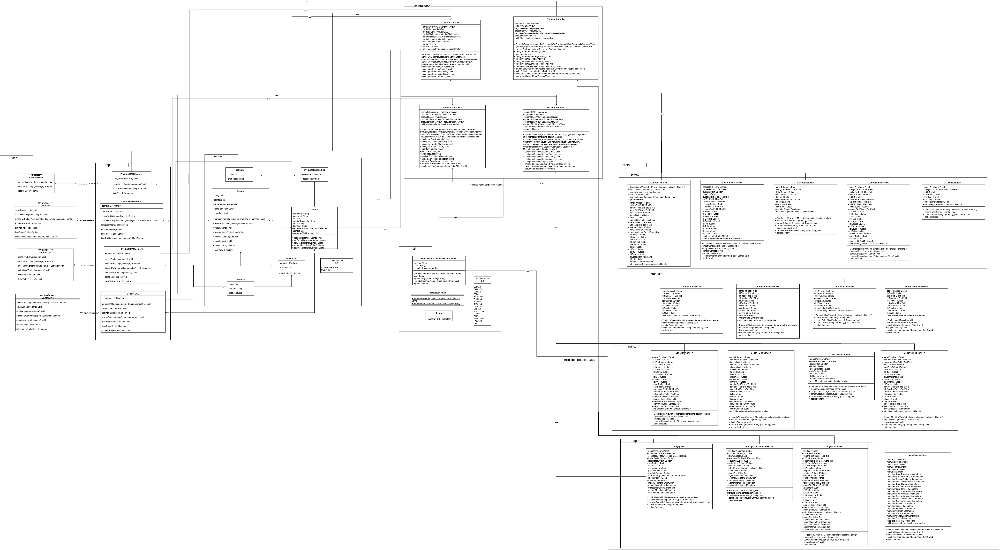

# 🛒 Proyecto de Ejemplo - Carrito de Compras

Este proyecto fue desarrollado como parte del **período 66** de la asignatura **Programación Orientada a Objetos** en la Universidad Politécnica Salesiana.  
Su objetivo principal es demostrar el uso de **patrones de diseño** aplicados a una aplicación Java con interfaz gráfica construida con **Swing**.

## Datos del Proyecto
- **Asignatura**: Programación Orientada a Objetos
- **Periodo**: 66
- **Docente**: Ing. Grabiel Leon
- **Estudiante**: Nicolas Cedillo
- **Fecha de entrega**: 4 De Julio de 2025
- **Repositorio**: https://github.com/nicolascedillo/CarritoDeCompras
---

## 🎯 Objetivo del proyecto

Implementar un sistema educativo que simula un **carrito de compras**, utilizando buenas prácticas de diseño y una arquitectura desacoplada basada en **MVC** (Modelo-Vista-Controlador), **DAO** (Data Access Object) y principios de **POO** y **SOLID**.

---

## 🛠️ Tecnologías utilizadas

- 💻 **Java 21**
- 🧰 **IntelliJ IDEA** (recomendado con el plugin de diseñador gráfico de interfaces Swing)
- ☕ **Swing** para la interfaz gráfica
- 📦 Estructura modular basada en paquetes: `modelo`, `dao`, `controlador`, `vista`, y `servicio`

---

## 🧱 Patrones de Diseño aplicados

- **MVC (Modelo - Vista - Controlador)**  
  Para separar la lógica de negocio de la interfaz gráfica.

- **DAO (Data Access Object)**  
  Para desacoplar el acceso a los datos, facilitando la migración a diferentes fuentes (archivos, base de datos, etc.).

- **SRP y DIP** de los principios **SOLID**  
  Para asegurar una arquitectura mantenible, extensible y fácil de testear.

---

## 📐 Diagrama UML de Clases

---
## Principios SOLID aplicados
- 1-	Principio de Responsabilidad Única (Single Responsibility Principle - SRP): La clase UsuarioController se encarga únicamente de la lógica relacionada con la gestión de usuarios, como el registro, autenticación y modificación de datos de usuario. No se encarga de la persistencia ni de la interfaz gráfica, lo que permite que cada clase tenga una única razón para cambiar. Esto facilita el mantenimiento y la extensión del código, ya que los cambios en la lógica de usuario no afectan a otras partes del sistema. 
- 2-	Principio de Abierto/Cerrado (Open/Closed Principle - OCP): Las interfaces DAO y sus implementaciones permiten que el sistema esté abierto a nuevas implementaciones sin modificar el código existente que depende de las interfaces. Esto permite agregar nuevas formas de persistencia de datos sin alterar el funcionamiento de los controladores o vistas. 
- 3-	Principio de Inversión de Dependencias (Dependency Inversion Principle - DIP): Los controladores reciben las dependencias (DAO y vistas) a través de sus constructores, en vez de crearlas internamente. Lo cual hace que no se cree una instancia de la clase dentro del constructor, sino se le pasa simplemente una, permitiendo cambiar las dependencias fácilmente.
---
---

## 📦 Estructura de Paquetes y Funciones Principales

### 1. `modelo` (Modelos de Dominio)
- **Carrito**: Gestiona productos agregados, fecha de creación, usuario asociado.
  - Métodos: agregarProducto(), eliminarProducto(), getCodigo(), getFechaCreacion(), etc.
- **ItemCarrito**: Representa un producto y su cantidad en el carrito.
- **Producto**: Información de productos (código, nombre, precio, stock).
- **Usuario**: Datos de usuario (nombre, correo, contraseña, rol).
- **Rol**: Enumera los roles posibles de usuario.
- **Pregunta, PreguntaRespondida**: Para funcionalidades de seguridad o recuperación.

### 2. `dao` (Acceso a Datos)
- **CarritoDAO, ProductoDAO, UsuarioDAO, PreguntaDAO**: Interfaces para operaciones CRUD.
  - Métodos: crear(), buscarPorCodigo(), actualizar(), eliminar(), listarTodos().
- **impl/**: Implementaciones en memoria de los DAOs (ej: CarritoDAOMemoria).

### 3. `controlador` (Controladores)
- **CarritoController, ProductoController, UsuarioController, LogInController**: Gestionan la lógica de interacción entre modelo y vista.
  - Métodos: manejar eventos de creación, modificación, eliminación, listado, login, etc.

### 4. `vista` (Vistas Swing)
- Subpaquetes: `carrito`, `producto`, `usuario`, `login`.
- Clases: Formularios y ventanas para crear, modificar, eliminar, listar entidades.
  - Ejemplo: CarritoCrearView, ProductoListaView, UsuarioCrearView, LogInView.

### 5. `util` (Utilidades)
- **FormateadorUtils**: Métodos de formateo de datos.
- **MensajeInternacionalizacionHandler**: Soporte para internacionalización.
- **Icono, Url**: Gestión de iconos y rutas de recursos.

---

<!-- Aquí puedes insertar el diagrama UML generado por alguna herramienta -->

---

## 📚 Recomendaciones

- Ejecutar el proyecto desde `Main.java`
- Usar IntelliJ IDEA para aprovechar el editor visual de formularios `.form`
- Probar con diferentes implementaciones del DAO para observar la flexibilidad del patrón

---

## © Créditos

Desarrollado como parte de la práctica académica en **Programación Orientada a Objetos – Periodo 66**.
